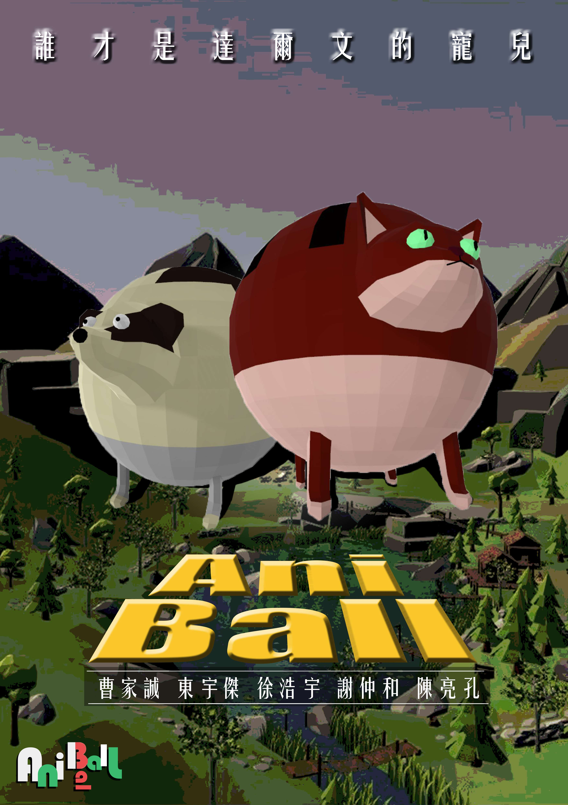

# AniBall

## Project Intro :dart:

This game is a multi-player party game built in Unity and featured with sphere-like adorable animals. It consists of two modes:
* Survival Mode : push your opponents out of the platform :crown:
* Soccer Mode : kick the watermelon to goal :watermelon: :soccer:

It is filled with splendid particle and collision effects, clear UI interface and simplicity for control.

For complete introduction of this game, please click [here(Youtube)](https://www.youtube.com/watch?v=gdgMeGkt90o&list=PLgXb5F54uz95qlXoSpcCAw75EAZR2Q3zc&index=9&t=0s).

## Gameplay Screenshot

</a>
</a>

## Game Download

* The whole game file can be downloaded by this link : [link](https://www.dropbox.com/s/pke7fkc7zdl1dmh/AniBall.zip?dl=0)
* After unzipping the downloaded files, click `Jelly Effect Test.exe` under the `AniBall` folder. Then press `Play` to enjoy your game!

## Game Features

</a>
</a>
</a>
</a>
</a>
</a>
</a>
</a>
</a>
</a>
</a>

Link to full report : [report](https://github.com/MaxHsu88/AniBall/blob/master/source/Game%20Intro.pdf)
